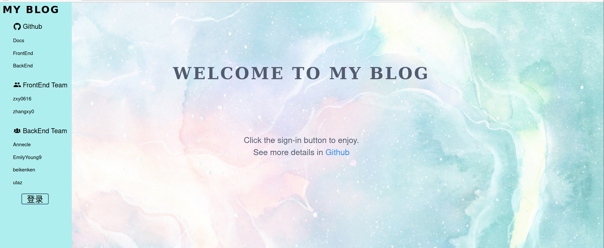
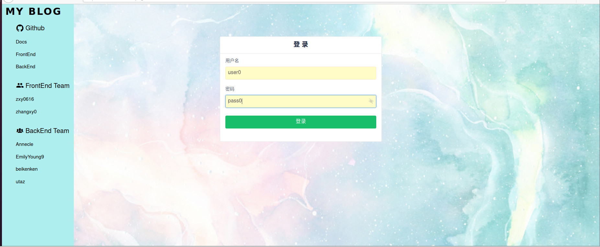
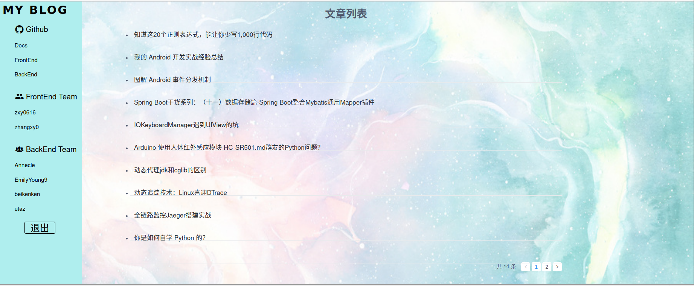
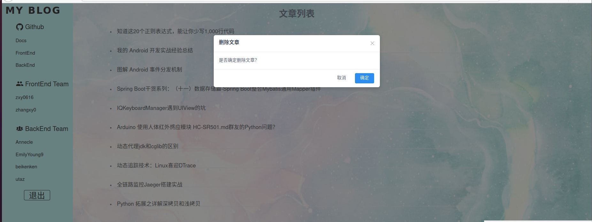
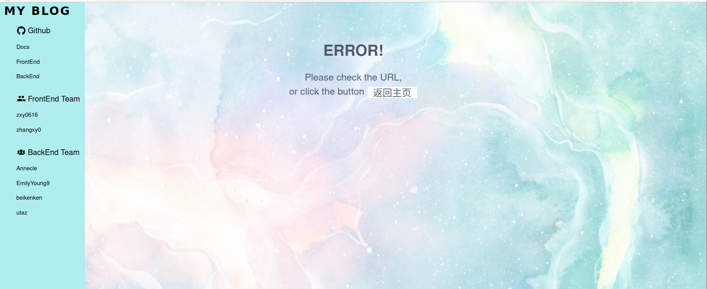
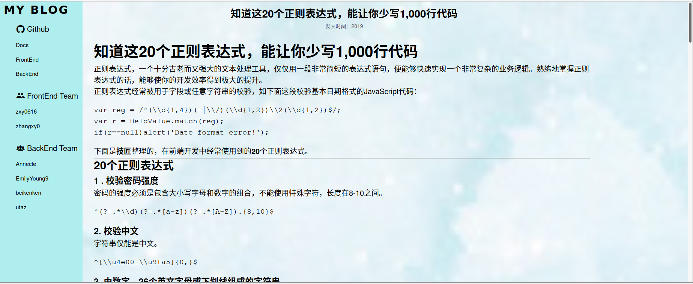
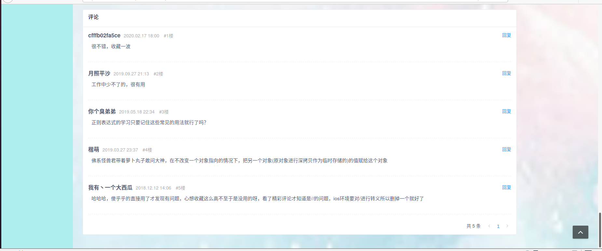
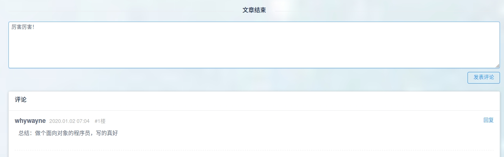
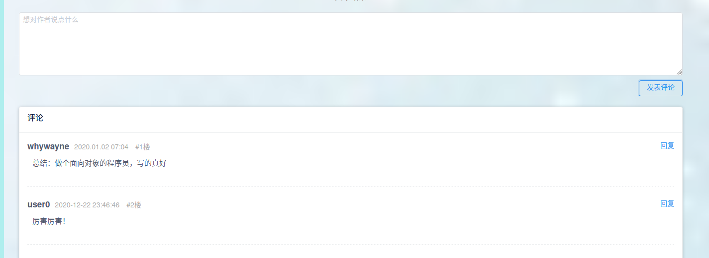

# 项目文档

## 基本信息

本次作业中我们实现了一个极简的博客，包含了用户登录，获取文章，删除文章，编辑评论，获取评论等功能。

除此之外，还实现了用户登录时获得TOKEN，并且添加评论时需要进行TOKEN认证的技术。

## 具体分工

在本次作业中，我们小组一共六人，其中两人负责前端，四人负责API以及后端设计。

具体分工如下：

- 前端
  - [zxy0616](https://github.com/orgs/ServiceComputing-Project/people/zxy0616) 张轩语（18342129）：[项目小结](https://blog.csdn.net/qq_43233275/article/details/111556495)
  - [zhangxy0](https://github.com/orgs/ServiceComputing-Project/people/zhangxy0) 张心悦（18342128）：[项目小结](https://blog.csdn.net/weixin_43985359/article/details/111567422)

- 后端
  - [EmilyYoung9](https://github.com/orgs/ServiceComputing-Project/people/EmilyYoung9) 杨玲（18342115）:[项目小结](https://shimo.im/docs/vTYDgPWXqX8QJPKy)
  - [Annecle](https://github.com/orgs/ServiceComputing-Project/people/Annecle)  周圆（18342143）：[项目小结](https://shimo.im/docs/JQW8QhdtX9GCdDxQ/)
  - [beikenken](https://github.com/orgs/ServiceComputing-Project/people/beikenken) 张又方（18342131）：[项目小结](https://blog.csdn.net/weixin_43227340/article/details/111558288)
  - [utaZ ](https://github.com/orgs/ServiceComputing-Project/people/utaZ) 邹文睿（18342146）：[项目小结](https://blog.csdn.net/weixin_45683170/article/details/111563379)


## 运行步骤

运行整个项目的步骤:

### 1．服务端

执行如下命令进行安装：

```
# 安装 Bolt DB
go get -u github.com/boltdb/bolt

# 安装 JWT 模块
go get -u github.com/dgrijalva/jwt-go

# 安装执行http请求的路由和分发的第三方扩展包mux
go get -u github.com/gorilla/mux

# 安装项目
go get -v github.com/ServiceComputing-Project/Server
```

执行如下命令运行：

```
go run main.go
```

### 2．客户端

```
# 克隆仓库
git clone https://github.com/ServiceComputing-Project/Client

# install dependencies
npm install

# serve with hot reload at localhost:8080
npm run dev
```

## API 说明

在本次实验中我们采用 REST v3 风格，设计了 6个API 服务，并使用 swagger-editor 来进行对API文档的编写

### 1. user

```yaml
"SignIn":"/signin/{username:password}"
```

### 2. article

```yaml
"GetArticles":"/user/articles",
"GetArticleById":"/user/article/{id}",
"DeleteArticleByID":"/user/article/{id}"
```

### 3. comment

```yaml
"GetCommentsOfArticle":"/user/article/{id}/comments",
"CreateComment":"/user/article/{id}/comment
```


## 运行结果

整个实验前后端耦合后的最终结果显示如下：

### 1.首页     



### 2.登陆界面       



### 3.登陆后进入个人博客列表

由右下角可以看出其实现了分页功能        

       

### 4.删除文章        



### 5.删除文章结果

可以发现上一个图中的最后一条博客已无       



### 6.点进文章查看博文内容        

       

### 7.查看博文最底部评论部分       

       

### 8.发表一条新的评论       



可以看出评论正常添加       

       


